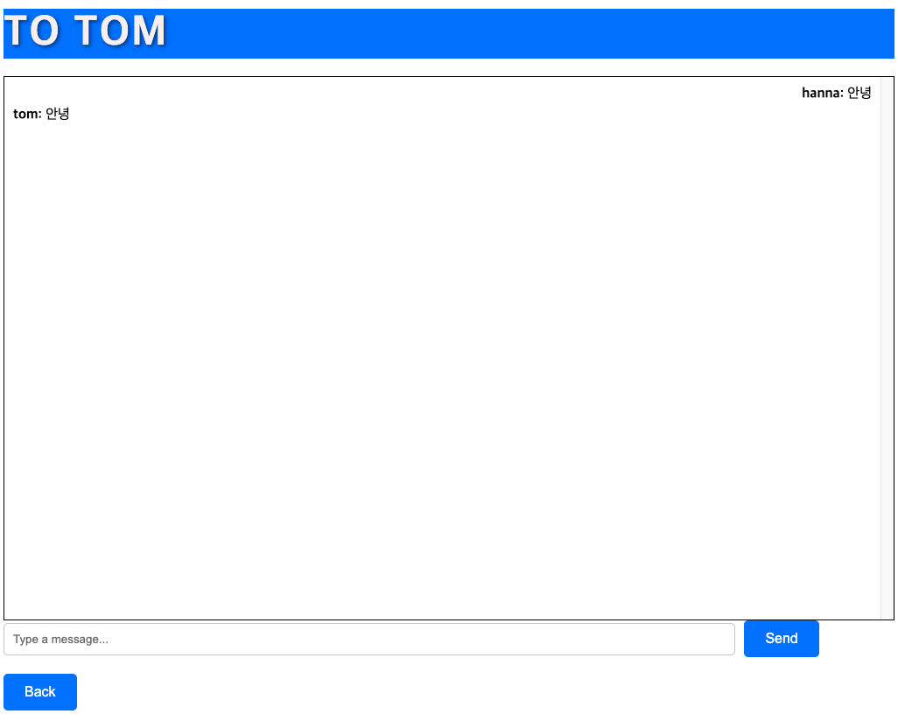

# MSACHAT
### MSA 구조의 실시간 화상 채팅 웹


### 프로젝트 구조
```
MSAZOOM
├── chat-service            # 채팅 서비스
├── message-service         # 메세지 서비스
├── user-service            # 유저 서비스
├── Dockerfile              # Docker 파일
├── docker-compose.yaml     # Docker Compose 파일
├── client                  # Frontend(NextJs)
├── traefik                 # Api Gateway
├── proto                   # gRPC Proto 명시
├── readme.md
└── docs                    
```

## 사용 기술
- **Go(Gin, Ent)**
- **Typescript(NextJS)**
- **WebRTC**: 실시간 화상 통신을 위해 사용(Chat)
- **WebSocket**: 실시간 텍스트 메시징을 위해 사용(Message)
- **gRPC**: 서비스 간 데이터 교환을 위해 사용
- **Traefik**: Request의 서비스 간 분기를 위해 사용(API Gateway)

## 주요 기능 
> **User Service(msazoom.userservice)**
    > - 회원가입 기능
    > - 로그인 및 로그아웃 기능.
    > - 친구 추가 및 관리 기능.
    > - 1:1 채팅
    > - 친구 삭제
    > - 팔로우 요청 보내기 및 수락하기 기능

> **Chat Service(chat.userservice)** 
    > - WebRTC를 이용한 실시간 화상 통신.
    > - 공개/비공개 방 구분
    > - 공개방 랜덤 채팅 기능
    > - 채팅 참여자 친구 추가 기능
    > - 단체 화상 채팅 기능 (TODO)
    > - 음소거/캠 off/Mute 기능 적용 (TODO)

> **Message Service(message.userservice)**
    > - 채팅방 생성 및 참여 기능.
    > - File/VOD 등 전송 기능 (TODO)
    > - 안 읽은 메세지가 몇개 왔는지 확인


## Traefik
### Request
- Port -> :7777
- **traefik/traefik.toml** 설정값 적용
```
# defaultEntryPoints = ["http", "https"]

[entryPoints]
  [entryPoints.http]
    address = ":7777"

[api]
  dashboard = true
  insecure = true

[providers]
  [providers.file]
    filename = "traefik.toml"
    watch = true

[http]
  [http.routers]
    [http.routers.userservice]
      entryPoints = ["http"]
      rule = "PathPrefix(`/msazoom.userservice`)"
      service = "userservice"
      
    [http.routers.messageservice]
      entryPoints = ["http"]
      rule = "PathPrefix(`/msazoom.messageservice`)"
      service = "messageservice"

    [http.routers.chatservice]
      entryPoints = ["http"]
      rule = "PathPrefix(`/msazoom.chatservice`)"
      service = "chatservice"


    # Adding a router for the Traefik dashboard
    [http.routers.api]
      rule = "PathPrefix(`/dashboard`)"
      service = "api@internal"
      entryPoints = ["http"]

  [http.services]
    [http.services.userservice.loadBalancer]
      [[http.services.userservice.loadBalancer.servers]]
        url = "http://127.0.0.1:8083"

    [http.services.messageservice.loadBalancer]
      [[http.services.messageservice.loadBalancer.servers]]
        url = "http://127.0.0.1:8081"

    [http.services.chatservice.loadBalancer]
      [[http.services.chatservice.loadBalancer.servers]]
        url = "http://127.0.0.1:8082"
```


### Dashboard
- Port -> :8080
- API Gateway Path 확인


## gRPC
PATH 환경변수 설정
```
export PATH="$PATH:$(go env GOPATH)/bin"
```
Proto 컴파일
```
protoc --go_out=. --go_opt=paths=source_relative \
    --go-grpc_out=. --go-grpc_opt=paths=source_relative \
    message/message.proto
```

## Docker


- 총 7개의 컨테이너
    - 3개의 Backend 서비스, 서비스 당 Postgres DB Container
    - Frontend Client Container

 


## 사용 방법

1. **로그인** 또는 **회원가입**하여 채팅 보드에 접근.
2. **채팅방 생성 또는 참여**를 채팅 목록에서 선택.
3. **친구 이름을 클릭**하여 화상 채팅 시작.
4. **채팅방에서 메시지 주고받기**.

## Pictures
> ### 대시 보드
> 

> ### 화상 채팅
> 

> ### 친구 채팅
> 


### TODO
- 기능별 MSA 분리
    - Pub/Sub 적용 (Kafka?)
    - gRPC로 서비스간 통신
- 1:N Streaming