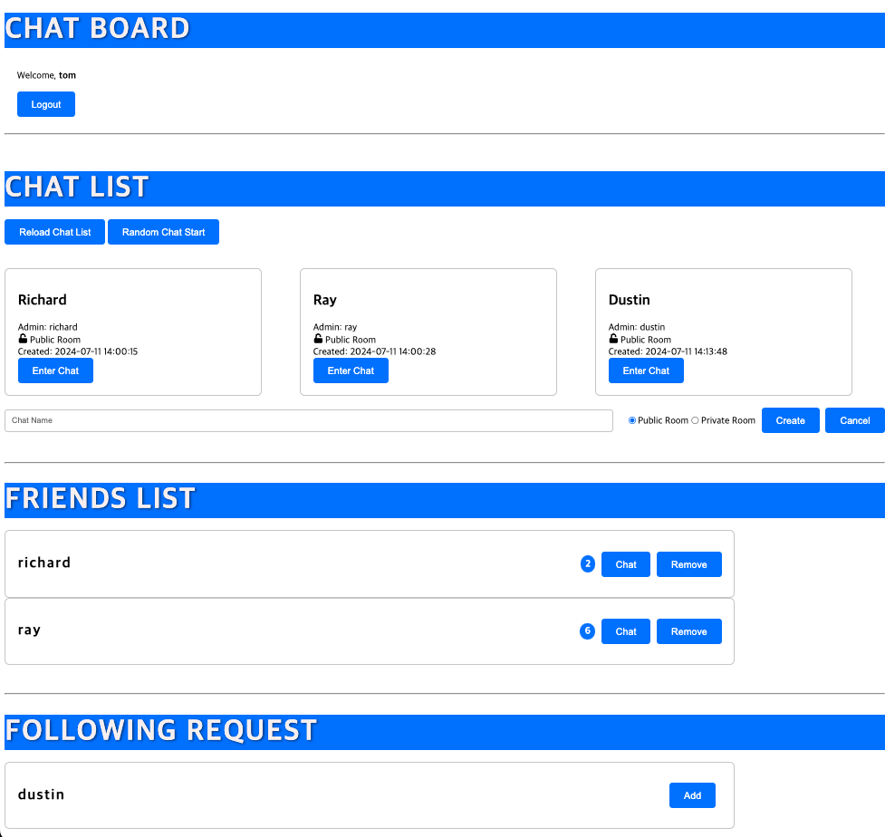

# WebRTC와 WebSocket을 이용한 화상채팅 애플리케이션

### TODO
- 기능별 MSA 분리
    - Pub/Sub 적용 (Kafka?)
    - gRPC로 서비스간 통신
- 1:N Streaming

## 주요 기능

- **사용자 인증**: 로그인 및 로그아웃 기능.
- **채팅방**: 채팅방 생성 및 참여 기능.
- **친구 목록**: 친구 추가 및 관리 기능.
- **팔로우 요청**: 팔로우 요청 보내기 및 수락하기 기능.
- **화상 채팅**: WebRTC를 이용한 실시간 화상 통신.
- **텍스트 채팅**: 채팅방 내 실시간 메시징.

## 사용 기술

- **WebRTC**: 실시간 화상 통신을 위해 사용.
- **WebSocket**: 실시간 텍스트 메시징을 위해 사용.
- **Go(Gin, Ent)**: 백엔드 서버.
- **Typescript(NextJS)**: 프론트엔드 로직.

## SetUp

1. Server
    ```bash
    go mod init
    go mod tidy
    ```
    ```bash
    go run main
    ```

2. Client
    ```bash
    git clone git@github.com:ddr4869/msazoom.git
    cd msazoom
    ```
    ```bash
    npm install
    ```
    ```bash
    npm run build
    ```
    http://localhost:3000

3. Deployment(daemon)
    ```bash
    docker-compose up -d
    ``` 


## 사용 방법

1. **로그인** 또는 **회원가입**하여 채팅 보드에 접근.
2. **채팅방 생성 또는 참여**를 채팅 목록에서 선택.
3. **친구 이름을 클릭**하여 화상 채팅 시작.
4. **채팅방에서 메시지 주고받기**.

## Picture

### 채팅 보드


### 화상 채팅


### 텍스트 채팅
